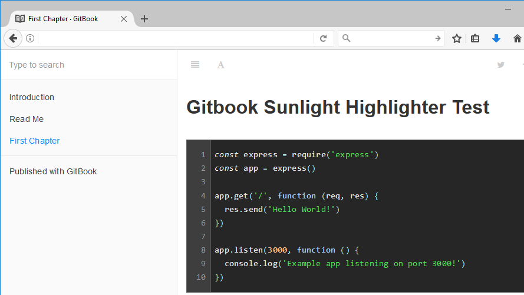

# Sunlight highlighter in GitBook
[Sunlight](http://sunlightjs.com/) is a context-aware, client-side syntax highlighter.
It does as a good of a job as can be done highlighting code without performing static analysis.



Licensed under Apache License 2.0.

_**Note: Please check the section [breaking changes](#breaking-changes) if your old book does not build anymore.**_

## Features

- Better syntax highlighting in some languages (but outdated in some others :-( )
- Has different themes (“gitbook”, “light”, “dark”)
- Line numbering
- Per code block settings ([demo here](https://lwchkg.gitbooks.io/tests-of-sunlight-highlighter/content/markdown-fenced.html)). It means you can select a different theme, line numbering, etc., in different code blocks.

## Installation

You use Sunlight highlighter by adding the following in the book configuration:
```
{
    plugins: ["-highlight", "sunlight-highlighter"]
}
```

Note that you should disable the "highlight" plugin as well as enabling the
"sunlight-highlighter" plugin. (In the GUI, an explicitly disabled plugin has a
pale orange color.)

** If you are using a non-default theme, or are using custom CSS, sunlight-highlighter may not show the correct output out-of-the-box.
See the section Styling Sunlight highlighter to fix potential issues. **

## Configuration

You can specify the following in the book configuration:

| Option | Default | Valid values | Description |
|--|--|--|--|
| `theme` | `"gitbook"` | any string | Syntax highlighting theme. Themes `"gitbook"`, `"light"` and `"dark"` are bundled with this plugin. |
| `lineNumbers` | `false` | `false`, `true` | Whether to show line numbers |

A sample configuration is shown below:

```json
"pluginsConfig": {
  "sunlight-highlighter": {
    "theme": "dark",
    "lineNumber": true
  }
}
```

*Note: if you supplied any invalid configuration or malformed JSON, the book will cease to build.*

## Usage

Like the default syntax highlighter in GitBook, fenced code blocks are used in this plugin.
However, not every language in highlight.js is supported.
See below for the list of supported languages.

### Example:

~~~
```vb
Dim x = 5
x = x ^ 2 + 1
Console.WriteLine("x = {0}", x)
```
~~~

## Options in each code block

`sunlight-highlighter` allows setting options in the language info.
The syntax is shown below:
~~~
```lang+option1:value1+option2:value2...
// Your source code
```
~~~

The following options are now available (all case sensitive):

| Option            | Description        |
|-------------------|--------------------|
| `theme`           | The theme. `gitbook`, `light` and `dark` are bundled with this plugin. |
| `lineNumbers`     | Whether to show line numbers. Valid values are `true` and `false`. |
| `lineNumberStart` | The line number of the first line. Can be any non-negative number. If not set, the value is 1. |

Here is an example that highlight with the `vb` language, use the `dark` theme, and shows line numbers which starts from `100`:
~~~
```vb+theme:dark+lineNumbers:true+lineNumberStart:100
// Your source code
```
~~~

See the ([demo](https://lwchkg.gitbooks.io/tests-of-sunlight-highlighter/content/markdown-fenced.html)) for more examples.

### Setting options in plugin include-codeblock

The plugin [include-codeblock](https://www.npmjs.com/package/gitbook-plugin-include-codeblock) imports source code from a file into your GitBook pages.
Starting from version 3.1.1, the plugin is compatible with sunlight-highlighter 0.3.0 to enter options in the language string.
See the ([demo here](https://lwchkg.gitbooks.io/tests-of-sunlight-highlighter/content/markdown-include-codeblock.html)).


## Supported languages and language codes

| Language                             | Code          |
|--------------------------------------|---------------|
| 6502 assembler                       | 6502asm       |
| ActionScript                         | actionscript  |
| bash                                 | bash          |
| Brainfuck                            | brainfuck     |
| C#                                   | csharp        |
| C/C++                                | cpp           |
| CSS                                  | css           |
| Diff (unified and context)           | diff          |
| DOS / Windows batch files            | batch         |
| Erlang                               | erlang        |
| Haskell                              | haskell       |
| httpd (Apache config)                | httpd         |
| Java                                 | java          |
| JavaScript                           | javascript    |
| Lisp                                 | lisp          |
| Lua                                  | lua           |
| MySQL                                | mysql         |
| nginx                                | nginx         |
| Objective-C                          | objective-c   |
| Perl                                 | perl          |
| PHP                                  | php           |
| PowerShell                           | powershell    |
| Python                               | python        |
| Ruby                                 | ruby          |
| Scala                                | scala         |
| T-SQL                                | tsql          |
| VB.NET                               | vb            |
| Visual Studio solution files (*.sln) | sln           |
| XML                                  | xml           |

In addition to the languages above, the following language code are available:

| Code | Function |
|------|----------|
| plaintext | No highlighting, but has theming and optionally add line numbers.
| nohighlight | Bypass the highlighter, i.e. no highlighting, no theming and no line numbers.
| (nothing)   | Same as “nohighlight”.
| any highlight.js language | Maps to the corresponding sunlight language if supported (see above for the list).

## Styling Sunlight highlighter

### Dealing with non-default theme or custom CSS

The following CSS is added to Sunlight highlighter to fit into the style of GitBook:

```css
.sunlight-code-container, .sunlight-line-number-margin {
	margin: -1em -1.1765em;
	padding: 1em 1.1765em;
}
```

This is done to offset the “0.85em 1em” padding created by GitBook. Code in GitBook is printed in 0.85em size, so we have 0.85/0.85 = 1(em) and 1/0.85 = 1.1765(em) in the offset code.

If you specify a different font size for the code, or is using a non-default theme, you should override these values with your own custom CSS. (It is sad that there is no all-in-one solution, and you need to make a different override for every different case.)

Note: `margin-right` and `padding-right` of `.sunlight-line-number-margin` are be further overridden.

## Custom themes

** Warning: the CSS for the themes will change in future versions. **

To add a custom theme:

1. Download a theme from (https://github.com/lwchkg/gitbook-plugin-sunlight-highlighter/tree/0.4.0/style/themes)
1. Edit the downloaded theme.
1. The name of the theme must consist only of letters, digits, `_` and `-`.
1. Suppose the name of your theme is `acme`.
   Create a new LESS stylesheet as follows:
    ````less
    .sunlight-theme-acme {
        @import (less) '[filename_of_your_theme.css]';
    }
    ````
   For other theme names, replace `acme` by the name of your theme.
1. Add your theme to your GitBook project:
   * [Compile your theme](http://lesscss.org/#using-less) using Less, then add the CSS to GitBook, or
   * Use the [styles-less](https://github.com/GitbookIO/plugin-styles-less) plugin.


## TODO
- Expose other configuration options in Sunlight highlighter.

## Breaking changes
### Version 0.4.0
- The plugin option `lineNumber` in `book.json` is renamed to `lineNumbers` (was a misspell). This is done so the option name is the same everywhere.

### Version 0.3.0
- CSS are changed.
  Overrides of CSS older versions will not work.

### Version 0.2.1
- "default" theme (in 0.2.0) is renamed to "light".

- The new default theme is "gitbook", which is essentially the "light" theme but with background color changed to `#f7f7f7` (same as the color of GitBook code area).
  If you prefer the old theme in 0.2.0, you should switch to the "light" theme.

## Known issues
- When line numbers are used, the e-book/PDF outputs are not satisfactory.

## Report bugs / Contributions
- To report issues and request features for the GitBook plugin, post an issue in the
  [GitHub repository](https://github.com/lwchkg/gitbook-plugin-sunlight-highlighter)
- For Sunlight highlighter in general, refer to the links.

## Links
- [Sunlight: intelligent syntax highlighting](http://sunlightjs.com/)
- [The “sexy” demo of original sunlight](http://sunlightjs.com/demo.html)
- [GitHub repository of Sunlight](https://github.com/tmont/sunlight)
